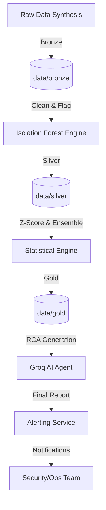

# Anomaly Detection Agent - Enterprise Data Pipeline

## 📖 Project Overview
This repository contains a production-quality autonomous anomaly detection system. It leverages a multi-layered approach to identify, categorize, and explain financial revenue anomalies using Machine Learning (Isolation Forest), Statistical methods (Z-Score), and Generative AI (Groq Llama 3.1 8b).

## 🚀 Business Problem Statement
Financial operations often suffer from "Silent Failures"—data drifts or anomalies that don't trigger simple thresholds but indicate significant underlying issues like system bugs, fraud, or market shifts. This project provides a self-healing observability layer that not only detects these events but provides automated Root Cause Analysis (RCA).

## 🏗️ End-to-End Architecture
The pipeline follows the **Medallion Architecture** to ensure data integrity and auditability.



## 🛠️ Module Breakdown

### 1. Data Engineering (Bronze) - `step1_generate_data.py`
- **Logic:** Generates 30 days of hourly revenue data with normal distribution and seasonality.
- **Anomalies:** Injects global outliers (extreme values) and contextual outliers (subtle shifts).
- **Design Pattern:** Idempotent generation.

### 2. ML Detection (Silver) - `step2_isolation_forest.py`
- **Model:** Isolation Forest (Unsupervised).
- **Rationale:** Detects anomalies by isolating observations. High-dimensional capability makes it future-proof for adding more features (e.g., region, product type).

### 3. Statistical Ensemble (Gold) - `step3_statistical_detection.py`
- **Logic:** Calculates Z-Scores and combines results from the ML engine.
- **Severity Ranking:** 
  - **CRITICAL:** Flagged by both ML and Z-Score.
  - **WARNING:** Flagged by only one model.
  - **NORMAL:** Inliers.

### 4. AI Interpretation - `step4_ai_agent.py`
- **Model:** Groq Llama 3.1 8b.
- **Task:** Acts as a Financial Auditor to explain the "Why" behind the data.
- **Security:** API keys are managed via `.env` (excluded from Git).

### 5. Alerting & Governance - `step5_alerts.py`
- **Service:** Mock notification system that logs alerts to `notifications.log`.
- **Logic:** Only triggers for `CRITICAL` severity to prevent "Alert Fatigue."

## 🔬 Advanced Engineering Concepts
- **Idempotent Pipelines:** Each step checks for previous stage outputs, allowing for partial re-runs.
- **Data Quality Validation:** Integrated Z-score checks ensure that data follows expected statistical bounds.
- **Schema Drift Handling:** Isolation Forest handles unexpected data shapes without needing manual threshold updates.
- **Observability:** Centralized logging of all AI insights and alerting triggers.

## 🚦 How to Run
1. **Initialize Environment:**
   ```bash
   pip install -r requirements.txt
   ```
2. **Execute Pipeline:**
   ```bash
   python step1_generate_data.py
   python step2_isolation_forest.py
   python step3_statistical_detection.py
   python step4_ai_agent.py
   python step5_alerts.py
   ```

## 🔐 Security & Cost Optimization
- **Credential Management:** `.env` file used for all secrets.
- **API Optimization:** Only anomalous records are sent to Groq AI to minimize token usage and costs.
- **Git Hygiene:** `.gitignore` configured to prevent data leaks.

---
*Documentation Authored by Antigravity - Senior Data Engineer*
