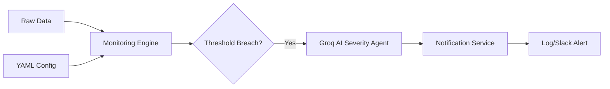

# Lab 6: Configurable Threshold Monitoring Agent

## Project Overview
This project implements a metadata-driven monitoring system that evaluates data quality metrics (like null rates) against dynamic thresholds. It features an AI-powered severity engine that interprets threshold breaches and suggests remediation actions.

## Business Problem Statement
Static data quality checks often lead to "alert fatigue" or missed violations as data scales and shifts. Hardcoded thresholds are difficult to maintain across multiple pipelines. This project solves this by centralizing monitoring configurations and using AI to prioritize incidents based on business impact.

## Objectives
- **Dynamic Configuration:** Manage thresholds via external config files.
- **Automated Monitoring:** Calculate DQ metrics (Null Rates, etc.) in real-time.
- **AI Severity Engine:** Use Groq Llama 3.1 8b to evaluate the impact of data quality violations.
- **Multi-Channel Alerting:** Mock Slack and Log-based notifications.

## High-Level Architecture


## Technical Stack
- **Core:** Python, Pandas
- **Config:** YAML / JSON
- **AI:** Groq API (Llama 3.1 8b)
- **Reporting:** Structured Logs

---

## How to Run

1. **Synthesize Data:** Generate the raw dataset with intentional quality issues.
   ```bash
   python3 step1_generate_data.py
   ```

2. **Run Monitoring Engine:** Evaluate data against `config/thresholds.yaml`.
   ```bash
   python3 step2_monitor_engine.py
   ```

3. **Analyze with AI:** Process failures and generate business impact alerts.
   ```bash
   python3 step3_ai_alerts.py
   ```

---
*Documentation Authored by Antigravity - Senior Solution Architect*
